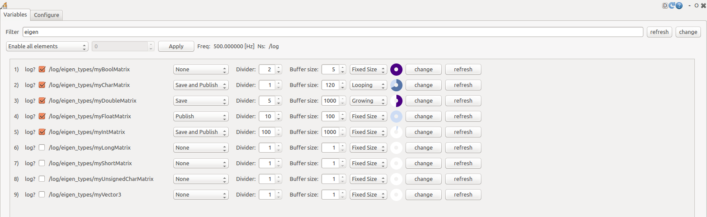
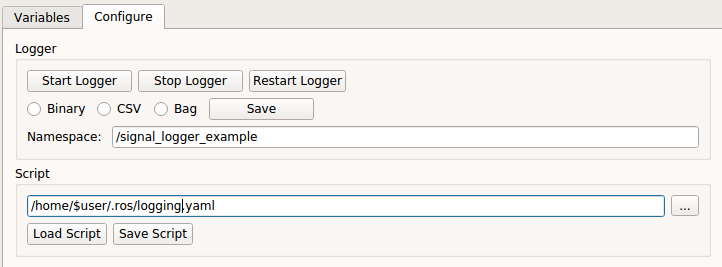

# Signal Logger RQT GUI

## Variable Configuration Tab

The variable configuration view lets you inspect and update logger elements.

Main controls:

- `Filter`: search for matching log elements
- `For All Action`: action to apply to all visible elements
- `For All Value`: value used by the selected for-all action
- `Apply`: preview the for-all action in the GUI without sending it
- `Freq`: current logger collection frequency
- `Ns`: logger namespace
- `Logger Element List`: all known logger elements
- `Change All`: apply all pending changes
- `Refresh All`: reload all element settings from the logger

Each logger-element row contains:

- `Nr`: alphabetical index
- `log?`: enable or disable logging for the element
- `Name`: fully qualified signal name
- `Action`: logging action
- `Divider`: integer divider
- `Buffer Size`: buffer capacity
- `Buffer Type`: fixed, looping, or growing
- `Buffer Indicator`: current fill state
- `Change`: apply the row
- `Refresh`: reload the row from the logger

## Logger Configuration Tab

The `Status` field at the top shows errors and success messages.

Logger controls:

- `Start Logger`
- `Stop Logger`
- `Restart Logger`
- `Save`
- `Binary`
- `CSV`
- `Bag`
- `Namespace`

The lower part of the view loads and saves logger scripts:

- `Path`
- `...`
- `Load Script`
- `Save Script`

